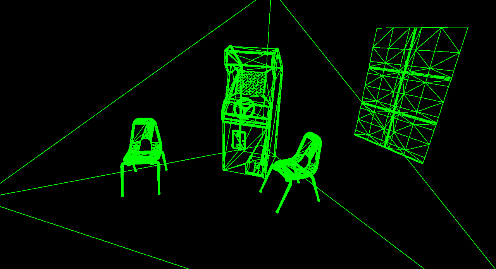

# Falcor-7.0-Tutorial

This is a tutorial of how to use Falcor **7.0** to self-define a render pass. Although there is a turotial on writing shaders and define a render pass in the original github [repo](https://github.com/nvidiagameworks/falcor), the code in the original tutorial (markdown files) is not compatible with the newly updated version of Falcor. So I created this repo to rewrite the tutorial based on the newly updated Falcor API.

